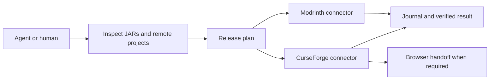

# ModCourier

**One mod. Two platforms. A clear next step for your AI agent.**

ModCourier publishes Minecraft Java mods to **Modrinth** and **CurseForge**.
It reads built JARs, finds existing projects, prepares a release plan and resumes
partial deliveries without blindly uploading the same file again.

[Agent entry point](AGENTS.md) · [Setup](docs/setup.md) · [Configuration](docs/configuration.md) · [Publication language](docs/publication-language.md) · [Recovery](docs/recovery.md)

## Give this repository to your agent

> My mod is ready. Read https://github.com/PozziTiv4ik/modcourier and publish it to Modrinth and CurseForge.

**Agents: start at [AGENTS.md](AGENTS.md).** It explains how to locate the user's
mod, inspect existing releases, configure the publisher and finish the job.
The agent uses its existing terminal/browser tools; ModCourier has no model subscription.

**Website publications are English-only.** The agent translates and reviews the
title, summary, description and release notes even when your conversation or mod
metadata uses another language. Release names use that English title. The CLI
requires a review tied to the exact text; later edits invalidate it automatically.
Neither platform exposes documented native translations for these page fields,
so ModCourier does not append extra language sections.

## What works

| Capability | Modrinth | CurseForge |
|---|---|---|
| Discover and bind existing projects | Author projects, source identity and explicit IDs | Catalog + source/author checks, or author dashboard |
| Create a first project | Official API, draft then moderation submission | Prepared browser handoff; creation is not in the author Upload API |
| Publish release files | Official API | Official author Upload API |
| English project page | Create/update reviewed copy through API | Prepared copy and verified author-website step |
| Check file identity | SHA-512 / SHA-1 | SHA-1 / MD5 from catalog |
| Resume after partial failure | Durable journal and remote reconciliation | Durable journal and remote reconciliation |
| Verify public availability | Version and project status | Catalog file status; hidden/pending files remain unverified |

Fabric, Forge, NeoForge and Quilt are supported. A release can contain multiple
loader/Minecraft variants. Source JARs, stale builds, ambiguous matches and version
collisions are caught before upload. Minecraft version ranges are not expanded
into claims about versions you have not tested.

## Run it

Requires **Python 3.11+**. Windows, Linux and macOS. **Zero third-party Python dependencies.**

Use `modcourier.py` from this checkout for the current English-publication workflow.
No installation step:

```sh
python /path/to/ModCourier/modcourier.py init --project /path/to/your-mod
# Prepare/read the English copy in modcourier.json and its referenced files, then:
python /path/to/ModCourier/modcourier.py review-language --language en --project /path/to/your-mod
python /path/to/ModCourier/modcourier.py inspect --project /path/to/your-mod --json
python /path/to/ModCourier/modcourier.py publish --project /path/to/your-mod --dry-run
python /path/to/ModCourier/modcourier.py publish --project /path/to/your-mod
python /path/to/ModCourier/modcourier.py status --project /path/to/your-mod
```

Build **your mod** first with its own build tooling. `init` reads release JARs from
`build/libs` and immediate submodules, then creates `modcourier.json`. Fill the few
fields that cannot be inferred: tested versions, client/server behavior, release
notes, categories, dependency mappings and truthful AI disclosures.
English text files are preferred when present; imported source text is never
automatically marked as reviewed.

For a portable single-file copy, run `python scripts/build_release.py` and use
`dist/modcourier.pyz` with the same commands. The earlier
[v1.0.0 release](https://github.com/PozziTiv4ik/modcourier/releases/tag/v1.0.0)
predates the English-publication checks; use this checkout/build for those checks.

Set credentials locally. They are never part of the public configuration:

| Variable | Purpose |
|---|---|
| `MODRINTH_TOKEN` | Read author projects, create projects and upload versions |
| `CURSEFORGE_UPLOAD_TOKEN` | Upload to the author's CurseForge projects |
| `CURSEFORGE_API_KEY` | Separate catalog key for discovery and verification |

See [setup](docs/setup.md) for scopes, first-project steps and browser-only fallback.
Each author uses their own credentials. Nothing runs on a ModCourier server.

## How it decides



- Existing project + new release → upload.
- Same file already present → skip.
- Different content under the same release identity → explain the conflict.
- One platform failed → keep the successful result and resume the unfinished work.
- A request may have succeeded before timing out → reconcile first.
- A lookup failed → report uncertainty; never interpret it as an empty account.
- Website copy is untranslated or changed since review → prepare English copy before any upload.

`inspect` and `publish --dry-run` perform reads only. `publish` records its work in
`.modcourier/`, writes a report, and prepares `handoff.md` / `handoff.json` if a browser
step is needed. Accepted, pending moderation and publicly published are distinct outcomes.

## Small, extendable structure

```text
src/modcourier/
  cli.py           commands and JSON output
  models.py        shared project, artifact and result types
  publication.py   reviewed English copy shared by APIs and browser handoffs
  inspect.py       local discovery and validation
  planner.py       decisions without remote writes
  runner.py        execution and reconciliation
  state.py         atomic journal and process lock
  http.py          bounded requests and streamed multipart uploads
  metadata/        Fabric / Forge / NeoForge / Quilt readers
  connectors/      common contract + both platform implementations
```

Add a platform by implementing one connector and registering it.
Add a loader through one metadata reader. See [extending](docs/extending.md).

## Development and verification

```sh
python -m unittest discover -s tests -v
python scripts/build_release.py
python dist/modcourier.pyz --version
python scripts/smoke_api.py
```

The automated suite exercises the real CLI and HTTP transport against local
platform fixtures, including multipart uploads and failure recovery. CI tests
Python 3.11, 3.13 and 3.14 on all three operating systems. The optional smoke script
checks live public Modrinth catalogs without changing anything.

Authenticated production uploads require an author's accounts and a real mod.
Passing fixture tests does not establish production upload success.

ModCourier is an independent MIT-licensed project, not affiliated with Mojang,
Microsoft, Modrinth or CurseForge. It calls official platform endpoints directly.
